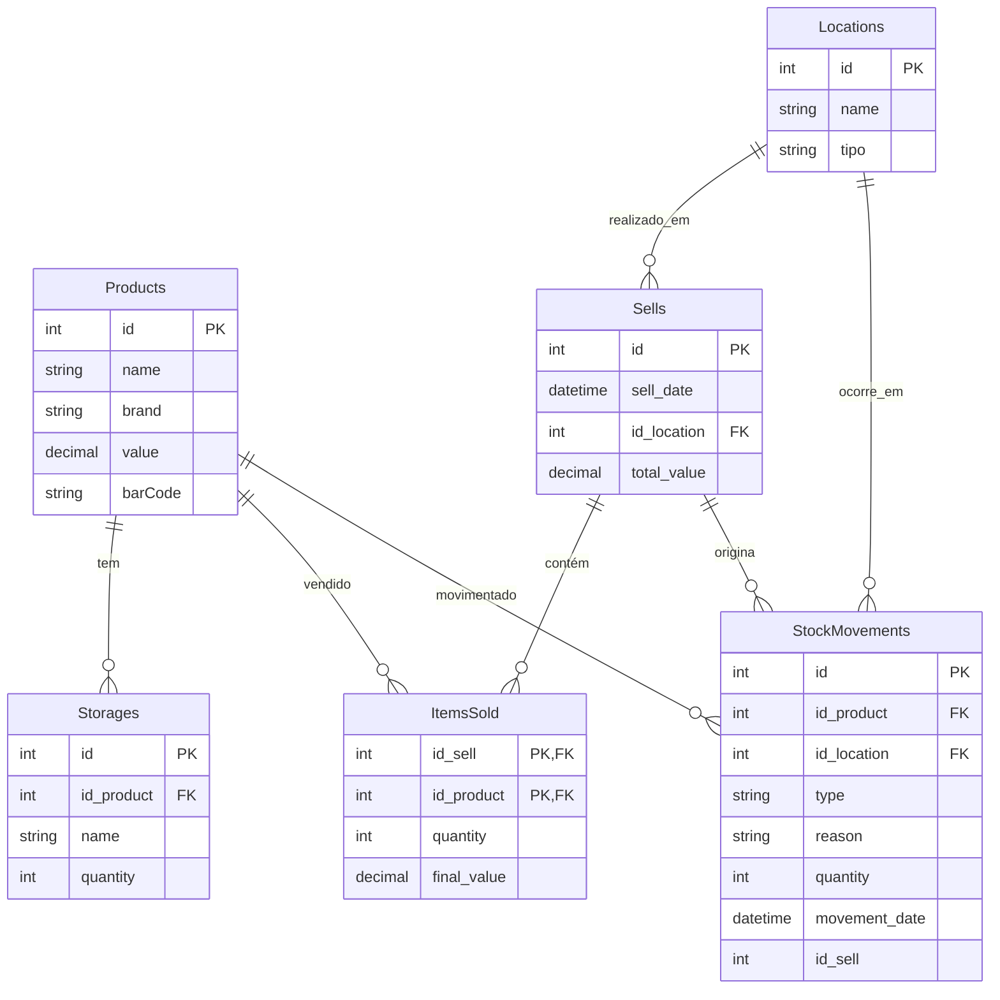

# Diagrama Entidade-Relacionamento - Sistema de Estoque/Vendas

```mermaid
erDiagram

    Products {
        int id PK
        string name
        string brand
        decimal value
        string barCode
    }

    Storages {
        int id PK
        int id_product FK
        string name
        int quantity
    }

    Sells {
        int id PK
        datetime sell_date
        int id_location FK
        decimal total_value
    }

    ItemsSold {
        int id_sell PK, FK
        int id_product PK, FK
        int quantity
        decimal final_value
    }

    StockMovements {
        int id PK
        int id_product FK
        int id_location FK
        string type 
        string reason
        int quantity
        datetime movement_date
        int id_sell
    }

    Locations {
        int id PK
        string name
        string tipo
    }

    Products ||--o{ Storages : "tem"
    Products ||--o{ ItemsSold : "vendido"
    Sells ||--o{ ItemsSold : "contém"
    Locations ||--o{ Sells : "realizado_em"
    Products ||--o{ StockMovements : "movimentado"
    Locations ||--o{ StockMovements : "ocorre_em"
    Sells ||--o{ StockMovements : "origina"

```
